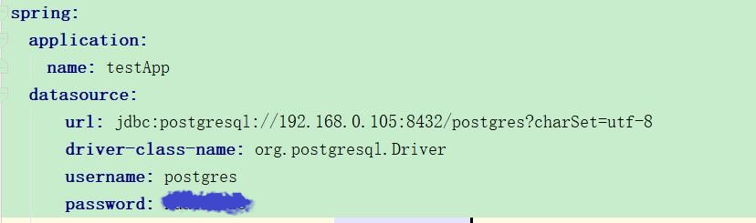

# **说明**
***

## 环境说明
条目 | 版本
--- | ---
操作系统 | CentOS 7
容器系统 | Docker
编译工具 | Maven 3.3
SDK系统 | JDK1.8
数据库 | PostgreSQL 9

***

## 设计思路
- docker容器启动数据库
    - 启动数据库容器
   ```bash
    docker run -p 8432:5432 -e POSTGRES_PASSWORD=****** postgres:latest -d postgres &
    ```
- 根据request的json来设计表结构
    - SQL，数据库客户端推荐使用Navicat for PostgreSQL
    ```sql
    create type item_type AS ENUM ('A', 'B', 'C');  
  
    DROP TABLE IF EXISTS "public"."t_items";
    
    CREATE TABLE "public"."t_items" (
      "id" uuid NOT NULL DEFAULT NULL,
      "businessId" varchar(64) COLLATE "pg_catalog"."default" DEFAULT NULL,
      "type" "public"."item_type" DEFAULT NULL,
      "standardItemIdentification" varchar(255) COLLATE "pg_catalog"."default" DEFAULT NULL,
      "sellersItemIdentification" varchar(255) COLLATE "pg_catalog"."default" DEFAULT NULL,
      "itemName" varchar(255) COLLATE "pg_catalog"."default" DEFAULT NULL,
      "period" timestamp(6) DEFAULT NULL,
      "unitCode" varchar(255) COLLATE "pg_catalog"."default" DEFAULT NULL,
      "currencyID" varchar(255) COLLATE "pg_catalog"."default" DEFAULT NULL,
      "receiptID" varchar(255) COLLATE "pg_catalog"."default" DEFAULT NULL,
      "comment" text COLLATE "pg_catalog"."default" DEFAULT NULL,
      "department" varchar(255) COLLATE "pg_catalog"."default" DEFAULT NULL,
      "priceWithTax" numeric(10,2) DEFAULT NULL,
      "quantity" int4 DEFAULT NULL,
      "amount" numeric(10,2) DEFAULT NULL
    );
    
    ALTER TABLE "public"."t_items" ADD CONSTRAINT "t_items_pkey" PRIMARY KEY ("id");
    ```
    
    - 修改数据库配置
        - src/main/resources目录下的application.yml
        
    
    - Maven Docker File
    ```dockerfile
    FROM java:8
    VOLUME /tmp
    ADD target/ex-example-1.0.0.jar app.jar
    ENV JAVA_OPTS=""
    ENTRYPOINT [ "sh", "-c", "java $JAVA_OPTS -Djava.security.egd=file:/dev/./urandom -jar /app.jar" ]
    ```
    - Maven Build Shell
    ```bash
    #!/bin/sh
    
    export JAVA_HOME=/root/jdk1.8.0_144
    export MVN_HOME=/root/apache-maven-3.3.3
    export PATH=$JAVA_HOME/bin:$MVN_HOME/bin:$PATH
    
    mvn clean package -Dmaven.test.skip=true dockerfile:build
    ```
    
    - Docker Image
    
    
    
    - Docker Ps
    
    
    
## 架构
- spring boot + mybatis
- druid
- junit + mockiot
- jacoco

***

## 覆盖率结果


